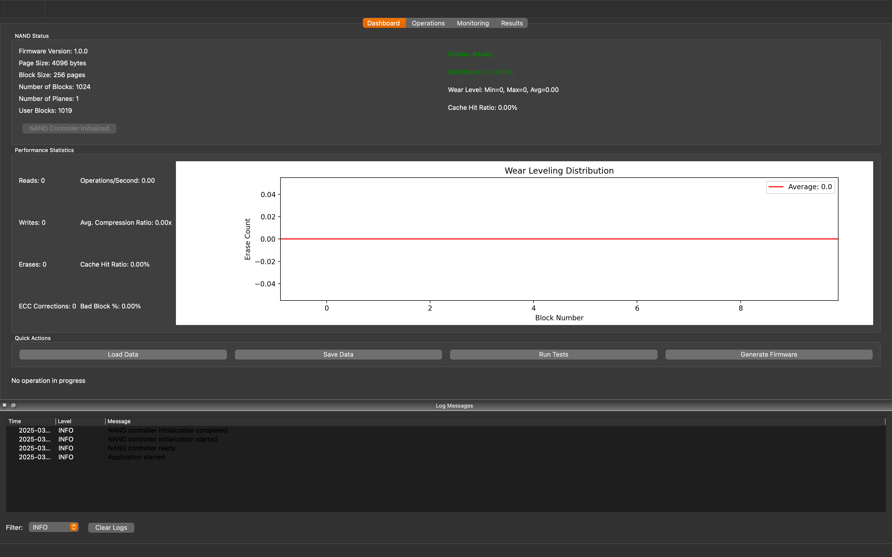

<div align="center">

# 3D NAND Optimization Tool

[](https://opensource.org/licenses/MIT)
[](https://www.python.org/)
[](https://github.com/muditbhargava66/3D-NAND-Flash-Storage-Optimization-Tool)
[](https://github.com/muditbhargava66/3D-NAND-Flash-Storage-Optimization-Tool)
[](https://github.com/muditbhargava66/3D-NAND-Flash-Storage-Optimization-Tool/docs)
[](https://3D-NAND-Flash-Storage-Optimization-Tool.readthedocs.io/)
[](http://makeapullrequest.com)
[](https://github.com/muditbhargava66/3D-NAND-Flash-Storage-Optimization-Tool/commits/main)
[](https://github.com/muditbhargava66/3D-NAND-Flash-Storage-Optimization-Tool/graphs/contributors)



**A comprehensive toolkit for optimizing 3D NAND flash storage performance, reliability, and efficiency through advanced defect handling, performance optimization, firmware integration, and NAND characterization.**
</div>

## 🚀 Features

- **NAND Defect Handling**
  - 🛡️ Advanced BCH and LDPC error correction implementations
  - 🔄 Dynamic bad block management
  - ⚖️ Intelligent wear leveling algorithms

- **Performance Optimization**
  - 🗜️ Adaptive data compression (LZ4/Zstandard)
  - 🚄 Multi-policy caching system (LRU, LFU, FIFO, TTL)
  - ⚡ Parallel access operations

- **Firmware Integration**
  - 📝 Template-based firmware specification generation
  - ✅ Comprehensive validation with schema and semantic rules
  - 🧪 Automated test bench execution

- **NAND Characterization**
  - 📊 Data collection and statistical analysis
  - 📈 Visualization of wear patterns and error distributions
  - 🔍 Performance and reliability assessment

- **User Interfaces**
  - 🖥️ Intuitive GUI with dashboard and monitoring
  - 💻 Interactive command-line interface
  - 🔌 Python API for integration with other tools

## 📥 Installation

### Prerequisites

- Python 3.9 or higher
- pip (Python package installer)

### From Source

```bash
# Clone the repository
git clone https://github.com/muditbhargava66/3D-NAND-Flash-Storage-Optimization-Tool.git

# Navigate to the project directory
cd 3d-nand-optimization-tool

# Create a virtual environment (recommended)
python -m venv venv
source venv/bin/activate.bat  # On Windows: venv\Scripts\activate

# Install dependencies
pip install -r requirements.txt

# Install in development mode
pip install -e .
```

## 🚀 Quick Start

```python
from nand_optimization import NANDController
from nand_optimization.utils import Config

# Load configuration
config = Config.from_file('config.yaml')

# Create controller and initialize
controller = NANDController(config, simulation_mode=True)
controller.initialize()

# Perform basic operations
controller.write_page(0, 0, b'Hello, NAND world!')
data = controller.read_page(0, 0)
print(data)  # b'Hello, NAND world!'

# Clean up
controller.shutdown()
```

## 🔍 Usage

### GUI Mode

Launch the graphical user interface for interactive operation:

```bash
python src/main.py --gui
```



### CLI Mode

Use the command-line interface for script-based or terminal operations:

```bash
# Basic CLI mode
python src/main.py --gui

# With custom configuration
python src/main.py --gui --config /path/to/config.yaml

# Run performance test script
python scripts/performance_test.py --iterations 100 --test-type all --simulate
```

### API Usage

```python
from nand_optimization import NANDController, ECCHandler, DataCompressor
from nand_optimization.utils import Config

# Setup
config = Config.from_file('config.yaml')
controller = NANDController(config)
controller.initialize()

# Batch operations using context manager
with controller.batch_operations():
    for i in range(10):
        controller.write_page(i, 0, f"Page {i} data".encode())
        
# Advanced features
ecc = ECCHandler(config)
compressor = DataCompressor(algorithm='lz4', level=5)

# Compress and encode data with ECC
data = b'Original data that needs protection and compression'
compressed = compressor.compress(data)
encoded = ecc.encode(compressed)

# Write encoded data
controller.write_page(10, 0, encoded)

# Clean up
controller.shutdown()
```

## ⚙️ Configuration

The tool is highly configurable through YAML configuration files.

### Default Configuration

The default configuration file is located at `resources/config/config.yaml`:

```yaml
# NAND Flash Configuration
nand_config:
  page_size: 4096   # Page size in bytes
  block_size: 256   # pages per block
  num_blocks: 1024
  oob_size: 128
  num_planes: 1

# Optimization Configuration
optimization_config:
  error_correction:
    algorithm: "bch"  # Options: "bch", "ldpc", "none"
    bch_params:
      m: 8            # Galois Field parameter
      t: 4            # Error correction capability
  compression:
    algorithm: "lz4"  # Options: "lz4", "zstd" 
    level: 3          # Compression level (1-9)
    enabled: true     # Enable/disable compression
  caching:
    capacity: 1024    # Cache capacity
    policy: "lru"     # Cache eviction policy
    enabled: true     # Enable/disable caching

# See documentation for full configuration options
```

For detailed configuration options, see the [Configuration Guide](docs/user_manual.md#configuration).

## 🏗️ Architecture

The tool follows a modular architecture with clear separation of concerns:

```
┌─────────────────────────────┐      ┌─────────────────────────────┐
│         User Interface      │◄────►│    Configuration Manager    │
└───────────────┬─────────────┘      └─────────────────────────────┘
                │
                ▼
┌─────────────────────────────┐
│        NAND Controller      │
└───┬───────────┬───────────┬─┘
    │           │           │
    ▼           ▼           ▼
┌─────────┐ ┌─────────┐ ┌─────────┐
│  NAND   │ │   Perf  │ │Firmware │
│ Defect  │ │   Opt   │ │   Int   │
│Handling │ │         │ │         │
└────┬────┘ └────┬────┘ └────┬────┘
     │           │           │
     ▼           ▼           ▼
┌─────────┐ ┌─────────┐ ┌─────────┐
│  Error  │ │  Data   │ │  Spec   │
│   Corr  │ │  Comp   │ │   Gen   │
└─────────┘ └─────────┘ └─────────┘
```

For more details, see the [System Architecture](docs/design_docs/system_architecture.md) documentation.

## Directory Structure

```
3d-nand-optimization-tool/
├── .github/
│   ├── ISSUE_TEMPLATE/
│   │   ├── bug_report.md
│   │   ├── feature_request.md
│   │   └── config.yml
│   ├── PULL_REQUEST_TEMPLATE.md
│   └── workflows/
│       ├── build.yml
│       └── lint.yml
├── docs/
│   ├── design_docs/
│   │   ├── system_architecture.md
│   │   ├── nand_defect_handling.md
│   │   ├── performance_optimization.md
│   │   ├── firmware_integration.md
│   │   └── nand_characterization.md
│   ├── CONTRIBUTING.md
│   ├── user_manual.md
│   └── api_reference.md
├── src/
│   ├── nand_defect_handling/
│   │   ├── __init__.py
│   │   ├── bch.py
│   │   ├── ldpc.py
│   │   ├── error_correction.py
│   │   ├── bad_block_management.py
│   │   └── wear_leveling.py
│   ├── performance_optimization/
│   │   ├── __init__.py
│   │   ├── data_compression.py
│   │   ├── caching.py
│   │   └── parallel_access.py
│   ├── firmware_integration/
│   │   ├── __init__.py
│   │   ├── firmware_specs.py
│   │   ├── test_benches.py
│   │   └── validation_scripts.py
│   ├── nand_characterization/
│   │   ├── __init__.py
│   │   ├── data_collection.py
│   │   ├── data_analysis.py
│   │   └── visualization.py
│   ├── ui/
│   │   ├── __init__.py
│   │   ├── main_window.py
│   │   ├── settings_dialog.py
│   │   └── result_viewer.py
│   ├── utils/
│   │   ├── __init__.py
│   │   ├── config.py
│   │   ├── logger.py
│   │   ├── file_handler.py
│   │   ├── nand_simulator.py
│   │   └── nand_interface.py
│   ├── nand_controller.py
│   ├── __init__.py
│   └── main.py
├── tests/
│   ├── __init__.py
│   ├── unit/
│   │   ├── __init__.py
│   │   ├── test_nand_defect_handling.py
│   │   ├── test_performance_optimization.py
│   │   ├── test_firmware_integration.py
│   │   └── test_nand_characterization.py
│   └── integration/
│       ├── __init__.py
│       └── test_integration.py
├── examples/
│   ├── basic_operations.py
│   ├── error_correction.py
│   ├── compression.py
│   ├── caching.py
│   ├── wear_leveling.py
│   ├── firmware_generation.py
│   └── examples.md
├── logs/
├── data/
│   ├── nand_characteristics/
│   │   ├── vendor_a/
│   │   └── vendor_b/
│   └── test_results/
├── resources/
│   ├── images/
│   └── config/
│       ├── config.yaml
│       ├── template.yaml
│       └── test_cases.yaml
├── scripts/
│   ├── validate.py
│   ├── performance_test.py
│   └── characterization.py
├── requirements.txt
├── pyproject.toml
├── MANIFEST.in
├── tox.ini
├── mypi.ini
├── CODE_OF_CONDUCT.md
├── CHANGELOG.md
├── .readthedocs.yaml
├── .gitignore
├── LICENSE
└── README.md
```

## 📚 Documentation

Comprehensive documentation is available in the `docs` directory:

- [User Manual](docs/user_manual.md) - Installation, configuration, and usage guide
- [API Reference](docs/api_reference.md) - Detailed API documentation
- [Design Documents](docs/design_docs/) - Architecture and module-specific designs
  - [System Architecture](docs/design_docs/system_architecture.md)
  - [NAND Defect Handling](docs/design_docs/nand_defect_handling.md)
  - [Performance Optimization](docs/design_docs/performance_optimization.md)
  - [Firmware Integration](docs/design_docs/firmware_integration.md)
  - [NAND Characterization](docs/design_docs/nand_characterization.md)

## 📊 Examples

The `examples` directory contains sample code demonstrating various features:

- [Basic Operations](examples/basic_operations.py) - Reading, writing, and erasing
- [Error Correction](examples/error_correction.py) - Using BCH and LDPC coding
- [Data Compression](examples/compression.py) - LZ4 and Zstandard compression
- [Caching](examples/caching.py) - Using different eviction policies
- [Wear Leveling](examples/wear_leveling.py) - Advanced wear leveling techniques
- [Firmware Generation](examples/firmware_generation.py) - Creating firmware specs

## 🤝 Contributing

Contributions are welcome! Please feel free to submit a Pull Request.

1. Fork the repository
2. Create your feature branch (`git checkout -b feature/amazing-feature`)
3. Commit your changes (`git commit -m 'Add some amazing feature'`)
4. Push to the branch (`git push origin feature/amazing-feature`)
5. Open a Pull Request

See [CONTRIBUTING.md](CONTRIBUTING.md) for more information.

## 🛠️ Development

For development setup:

```bash
# Install development dependencies
pip install -r requirements-dev.txt

# Setup pre-commit hooks
pre-commit install

# Run code formatting
tox -e format

# Run type checking
tox -e type

# Run linting
tox -e lint
```

## 🧪 Testing

The project uses pytest for testing:

```bash
# Run all tests
pytest

# Run specific test categories
pytest tests/unit/
pytest tests/integration/

# Run tests with coverage report
pytest --cov=src tests/

# Run specific test file
pytest tests/unit/test_nand_defect_handling.py
```

## 📋 Compatibility Matrix

| Python Version | Linux | macOS | Windows |
|----------------|-------|-------|---------|
| 3.9            | ✅    | ✅    | ✅      |
| 3.10           | ✅    | ✅    | ✅      |
| 3.11           | ✅    | ✅    | ✅      |
| 3.12           | ✅    | ✅    | ✅      |
| 3.13           | ✅    | ✅    | ✅      |

## 📄 License

This project is licensed under the MIT License - see the [LICENSE](LICENSE) file for details.

---
<div align="center">
  
**Enjoy using the 3D NAND Optimization Tool?**  
⭐️ Star the repo and consider contributing!  
  
📫 **Contact**: [@muditbhargava66](https://github.com/muditbhargava66)
🐛 **Report Issues**: [Issue Tracker](https://github.com/muditbhargava66/3D-NAND-Flash-Storage-Optimization-Tool/issues)
  
© 2025 Mudit Bhargava. [MIT License](LICENSE)  
<!-- Copyright symbol using HTML entity for better compatibility -->
</div>